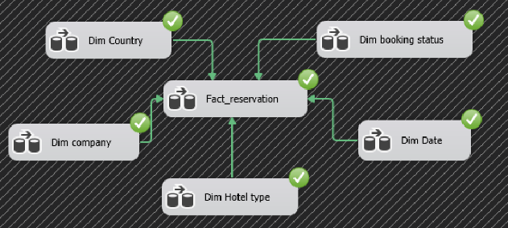
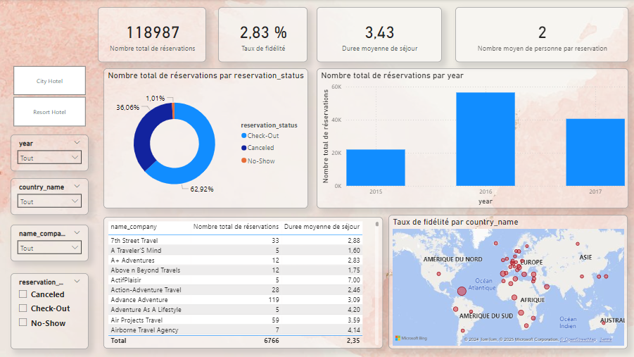

<h1 align="left">📊 Data Warehouse et Tableau de Bord pour le Secteur Hôtelier</h1>

###

 

<h3 align="left">🎯 Contexte du Projet</h3>

###

Ce projet académique vise à répondre aux défis du secteur hôtelier en utilisant des données de réservations pour mieux comprendre les préférences des clients et optimiser les performances des hôtels. À partir du dataset "Hotel Booking Demand", un entrepôt de données (data warehouse) a été construit, accompagné d'un cube OLAP et d'un tableau de bord interactif réalisé avec Power BI.

###

 

<h3 align="left">📝 Objectifs du Projet</h3>

###

✨  Analyser les données de réservation pour extraire des informations pertinentes, telles que  telles que le taux de réservation, le taux d'annulation, le taux de fidélité, et la durée moyenne des séjours.  ✨ Optimiser les processus de décision en proposant des outils d’analyse adaptés aux décideurs du secteur hôtelier.  ✨ Améliorer la stratégie de marketing, de réservation et de gestion à travers des rapports clairs et des visualisations interactives.

###

 

<h3 align="left">⚙️ Fonctionnalités</h3>

###

<h4 align="left">___✅ Entrepôt de données :</h4>

###

Modélisation et conception d'un data warehouse pour centraliser et structurer les données.

  

###

<h4 align="left">___✅ Cube OLAP :</h4>

###

Création d'un cube multidimensionnel pour l'analyse des données selon plusieurs dimensions .

###

<h4 align="left">___✅ Tableau de bord Power BI  :</h4>

###

Visualisations interactives permettant d'explorer les indicateurs clés comme les taux de réservation, le taux de fidélité et les annulations.

###

  

###

 

<h3 align="left">👨🏻‍💻 Technologies utilisées :</h3>

###

  
  
  
  
  

###

SQL Server Management Studio (SSMS) Microsoft Visual Studio Code Microsoft Power BI

###

 

<h3 align="left">📌 Conclusion :</h3>

###

Ce projet illustre l'utilisation pratique des outils de BI pour résoudre des problématiques concrètes du secteur hôtelier.

###

<h6 align="left">🔗 N’hésitez pas à consulter les données et la presentation attaché à ce dépôt pour plus de détails. Vos commentaires et suggestions sont les bienvenus !</h6>

###
